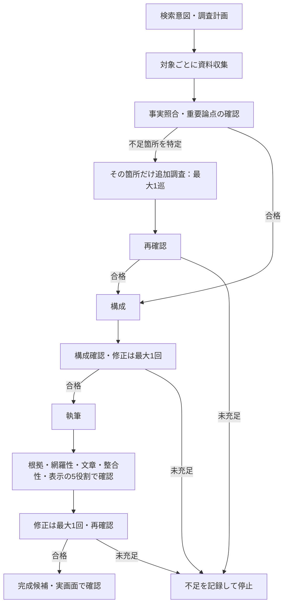

# 記事生成フローの棚卸し・簡略化（2026-10-03）

## 現在の到達点

別ブランチ `codex/quality-flow-simplification` に実装。比較基準は `239253d`。
外部生成API呼び出しは0回。本番・フロントへの反映はしていない。
重複調査を減らす制御は検証済み。新フローの記事完成、文章品質、300円以内の実費は未検証。

## 変更後の流れ

構成確認から全サービスを再調査する経路を除去した。追加調査は質問IDが特定できる場合のみ実行する。
再開しても追加調査の枠は増やさず、完了済み対象の結果は同じ入力・同じ取得本文なら再利用する。
これは未承認の調査メモの再利用であり、品質判定の省略ではない。
途中失敗した対象の再試行回数まで永続的に固定したわけではなく、全ジョブの絶対上限回数とは区別する。

調査計画の修正では、AIが作った不要な補助質問・重複を理由付きで整理できるようにした。
必須質問の単純削除・任意質問への格下げは拒否し、統合時は同対象の必須質問に残し、計画レビューで意味を確認する。
保存済み109問を実際に再編集したわけではない。修正プロンプトが期待どおり働くかは未検証。

## 保存済み実データによる検証

キーワード：既婚者 マッチングアプリ おすすめ

| 項目 | 変更前 | 変更後 |
|---|---:|---:|
| 同じ109問を収集する単位 | 22 | 12 |
| 収集1巡のクライアント要求回数上限 | 176 | 36 |
| 同条件で完了済み収集を再開した際の追加要求 | 比較未測定 | 0 |
| 保存済み根拠で不合格になる項目 | 33 | 33 |

この回数は通信の自動再試行・サーバー側検索・その他工程を含む総リクエスト数ではない。費用削減率にも換算できない。
架空の引用を挿入した場合も拒否。ネットワークを禁止した284テストが合格。
保存済みメモを使った制御検証であり、AIが新しく調査・執筆した品質評価ではない。

再現用：
- `evaluations/tiered-facts/replay_simplified.py`：取得済み資料で制御と根拠判定を比較。
- `evaluations/tiered-facts/simplified-replay-20261003.json`：結果。
- `evaluations/tiered-facts/preflight_simplified.py`：送信せず予算制御を確認。
- `evaluations/tiered-facts/simplified-cost-preflight-20261003.json`：結果。

## 費用確認で見つかった未解決の問題

通常の品質確認予算は1.25ドル。一方、現状の予算制御は、モデル内蔵検索3回付きの追加調査1要求に24.165ドルを仮予約する。
検索による入力膨張を最大寄りに見積もる式が原因であり、24.165ドルは実費でも期待費用でもない。
このままでは通常モードは送信前に停止する。過去の完了検証モードはこの仮予約と別の累積観測額で動いており、通常モードの費用成立を証明していない。
今回は予算上限を変更せず、有料の通しテストを開始していない。

次の修正対象は品質判定の追加ではなく、調査の入力量・検索量と予算計算の整合性。
既知URLの本文確認は検索ツールを付けない要求に分離し、検索が必要な場合だけ別の上限付き処理にする案を優先する。
その際は、全工程の予測費用、送信前の安全側予約、実測額を区別し、検索結果の隠れた入力膨張を無視して予約額だけ下げない。
現在の回数削減だけでは300円成立の見込みを出せないため、ここが有料テスト再開の未達条件。

## 本番反映の条件

費用設計の整合性を先に解消し、同じキーワード・プリセットで通常フローを一度通す。
記事全体と実画面、費用記録まで確認してから反映を判断する。
保存済み記事の手直しを通常フローの成功として扱わない。
