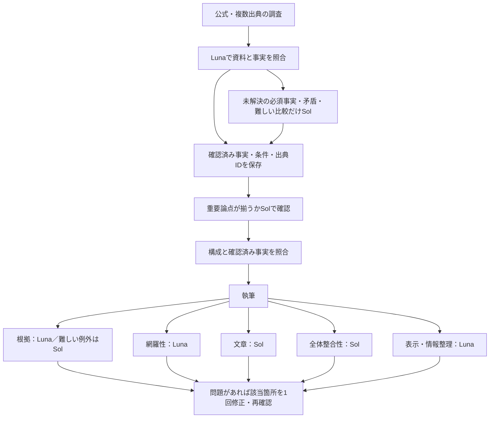

> 続報：[根拠共有の無料試作](20261003-shared-context-experiment.md) では6万トークンに収まらず、以下の291円配分案は採用・有料テスト再開の根拠にしないと判定しました。

# 2026-10-03 品質確認の費用棚卸しと300円設計

## 結論・現在地

**追加の生成API実行は0回。上限変更なし。本番反映なし。**

安全に削れる重複はテストブランチで修正した。ただし、この変更だけでは300円以内に収まらない。
全工程の予算配分は作ったが、必要な資料を配分内へ収める実装・品質検証は未完了。
「配分額が300円以下」と「通常フローで品質を維持して300円以下で完成」は区別する。現時点で有料通しテストを再開する根拠は不十分。

## 根本原因

1. **全担当へ調査記録一式を渡していた。** 保存済みのマトリクスは158,103文字。文章・整合性・表示の担当にも、質問・原文引用・探索履歴・判定記録を付けていた。
2. **同じ資料を工程ごとに広く再読していた。** 対象別Luna→対象別Sol→全体網羅性→構成→完成記事。確認する目的は違うが、資料の渡し方がほぼ同じ。
3. **例外1問でも対象全体の資料と記事全体の計画を再送していた。** 新しい省略条件でもSolへの要求は10回。要求内の質問を減らすだけでは入力は大きく減らない。
4. **個別質問の探索記録を要求する実装が残っていた。** 同じサービスの主な公式本文を確認済みでも、補助質問自身に記録がないだけでSolへ送っていた。
5. **修正費用を含めた全工程の予算設計がなかった。** 執筆前で予算を使い、構成修正・本文修正・再確認の枠が残らない。

## 今回実装・無料検証したもの

| 変更 | 保持する確認 |
|---|---|
| 文章・整合性・表示へ調査計画/判定一式を送らない | 記事全文、利用者指定、編集ルール、各担当の全チェック項目 |
| 根拠・網羅性へ渡す内部ハッシュ等を削除 | 全質問、全回答、全引用、適用条件、未解決・省略記録 |
| 構成本文とoutlineが同一なら1回だけ送る | 元の構成全文。異なる構成は別途保持 |
| 同一対象の確認済み公式根拠を補助情報省略の前提に利用 | 必須項目は省略不可。別サービスからの流用不可。未確認の詳細は本文に使わない。全体網羅性で不足なら停止 |
| 判定方針IDを更新 | 古い全体合格を新方針の合格として流用しない |

305件のネットワーク禁止テストが合格。5担当すべてへ記事全文が届くこと、利用者指定と根拠・条件が維持されること、別対象の公式確認を流用しないことを検査した。
モデル変更はまだ実行経路へ適用していない。新しい記事や品質合格は作っていない。

## 保存データによる入力サイズ試算

対象：今回の調査記録・プリセットと、以前の13,408文字の記事を**サイズ見本として組み合わせたもの**。
新フローがその記事を生成したという意味ではない。保存マトリクスは旧判定であり、今回の全体合格ではない。
学習済み文体ルールはローカルにないため未算入。記事長・資料量が増えれば費用も増える。

| 担当 | 修正前の入力概算 | 修正後の入力概算 |
|---|---:|---:|
| 文章 | 107,346 | 17,724 |
| 全体整合性 | 107,354 | 17,732 |
| 表示・情報整理 | 107,527 | 17,905 |
| 構成確認 | 233,397 | 224,584 |

単位はローカルo200kによるトークン概算。APIの正確な課金トークンではない。
同じ要求の保存済み実績との比は約0.95〜0.98。試算にはさらに1.2倍の入力余裕と出力上限を使用した。
原資料を残した構成・根拠確認は依然大きく、これが次の修正対象。

現状の要求サイズと最大出力を組み合わせると、修正後も通常確認の試算は約788円。本文修正と最終5担当の再確認を加えるとさらに増える。
これは請求実績・平均費用・保証された上限ではない。旧記事との組合せ、出力上限、長文単価境界により大きく変わる。追加調査と構成修正、生成本体はこの試算に含まない。
この数字をそのまま課金して検証することはしない。

## 次の設計：確認役割は残し、根拠の受け渡しを変える

- 原文照合済みの事実は、条件・出典・時点付きの共通記録で後工程へ渡す。後工程で新しく現れた主張や矛盾だけ、原資料へ戻して確認する。
- 「確認済み」の継承は資料・主張・条件の識別子に結び付ける。出典本文や条件が変わったら再確認。古い合格や手編集本文を通さない。
- Solの例外判定は全対象の資料を毎回送らず、未解決事項と関連本文・前後条件を束ねる。抜粋で条件が確認できないなら拡張する。材料不足を合格にしない。
- 文章・整合性・表示は統合しない。全文の文章・整合性確認も残す。
- 構成修正は原資料を全量付けた構成の作り直しから、確認済み事実に沿った1回の限定修正へ変更する案。本文修正と別枠で見積もる。
- 出力打ち切り・不足の隠蔽で価格だけ達成しない。予算で停止した記事は未完成であり、運用上の成功率にも含めない。

## 配分案（実測予測ではなく、実装が満たすべき条件）

既存コードの安全側単価、1 USD=200円の予算用換算。生成本体は別。

| 工程 | 枠 |
|---|---:|
| 調査一次照合：Luna | 22円 |
| 調査の例外確認：Sol | 50円 |
| 調査全体の網羅性：Sol | 23.5円 |
| 構成確認：Sol | 21円 |
| 完成記事の5担当 | 36.45円 |
| 本文修正1回 | 31円 |
| 完成記事5担当の再確認 | 36.45円 |
| 少量の追加調査・検索3回 | 18.6円 |
| 構成修正1回 | 31円 |
| 構成の再確認 | 21円 |
| **合計** | **291円** |

最初の239円案に、構成修正と再確認52円を加えた。300円までの余裕は9円しかない。
形式不正による追加応答などを無条件に許す設計ではない。既存の品質上限250円にもこの最大配分は入らない。今回は上限を変更していない。

**最も大きい未達条件：Solの調査入力は現状で約324,565トークン（10要求合計）だが、配分案は60,000トークンを前提にしている。**
この約5.4倍の差を、重要な資料や条件を失わずに埋められるかは未検証。
同様に構成確認・根拠確認・修正の入力枠と、軽いモデルでの品質維持も未検証。
したがって291円を「今後の予想料金」とは報告しない。

## 有料検証を再開する前の条件

1. 新しい共通根拠記録と例外用入力を保存済みデータで構成し、**資料を切り捨てずに**上の入力枠へ入るか計測する。
2. 出典・価格条件・時点・省略理由の対応を逆引きでき、資料変更時に判定が無効になることを無料テストで確認する。
3. 必須情報不足、条件の混同、文章不自然、矛盾、長文表示を含む少数の回帰事例で、新しいモデル配分を試す。これは有料となるので、今は実行しない。
4. その後、単一記事を完成・画面確認まで通す。費用と完成率を同時に記録し、予算内停止を成功扱いしない。

再現スクリプト：`evaluations/tiered-facts/audit_full_flow_cost.py`。
サイズ結果：`full-flow-cost-20261003.json`。配分：`proposed-cost-envelope-20261003.json`。
