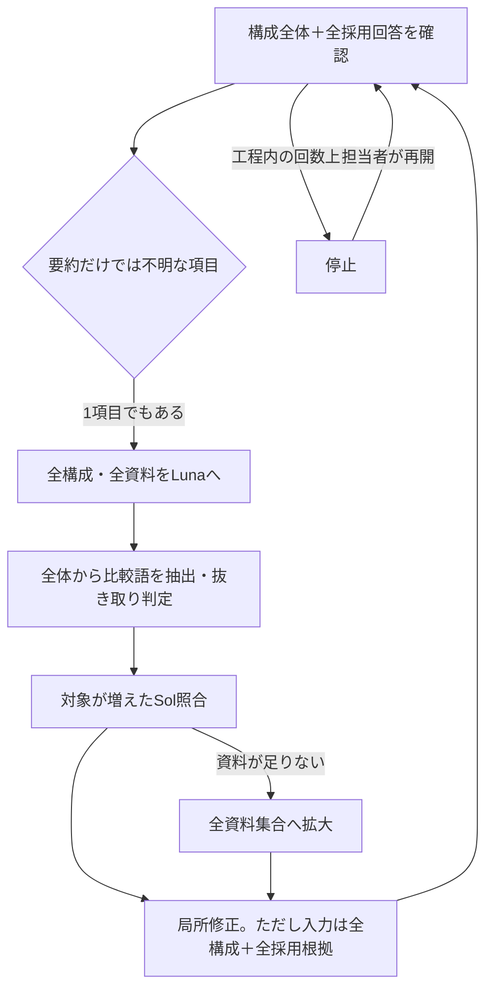

# 依頼・実装・実行結果の棚卸しと整理方針

確認日：2026-10-05。対象：`codex/quality-flow-simplification`、コード基準 `02bee5e`。
この作業は読み取りと報告書作成のみ。アプリ実装、既存テスト、台帳、構成、記事は変更していない。生成API・外部取得・本番操作は実行していない。

## 判定

**依頼の目的は未達。確認処理の一部を置き換える必要がある。プロンプトの追記だけでは解決しない。**

現在できているのは、保存済み調査の合格、当該記事の構成合格、サービス・CTA配置まで。本文生成は費用上限で送信前に停止。通常フローで品質・費用・完成の三つが成立した実績はない。

局所修正や資料重複の削減には実装上の効果があるが、「修正を局所化した」ことと「確認対象・入力資料・通算費用を局所化した」ことは別。後者が成立しない状態で有料再開を繰り返した。

この判定は現在の検証ブランチに対するもの。本番の実稼働設定・全過去請求は今回確認していない。ユーザーが述べた累計7万円以上との照合は、今回の単一ジョブ台帳からはできない。

## 1. 依頼と実装の対応

| 依頼・合意した要件 | 実装・実行で確認できること | 判定 |
|---|---|---|
| 特定記事を手で直すのでなく、通常生成で品質を担保 | 共通処理の変更は存在。当該テストでは本文未生成 | 未達 |
| 確認費用は約300円以内。生成費用とは分ける | 通常枠$1.25はあるが、実テストは完了検証モードでその枠を外し、累計枠を拡大して実行 | 未達。実テスト結果は300円成立の証明にならない |
| 同じ資料を大量に何度も読ませない | 一要求内の二重掲載・引用重複は一部削除。工程間・再開間の同じ論点の再照合は残る | 部分実装、目的未達 |
| 分割確認でも整合性を取る | 事実・網羅性・文章・整合性・表示の担当を分離。ただし修正後は全担当の入力が変わり、広い範囲を読み直す | 部分実装、完成本文で未検証 |
| 調査段階で必要情報を揃える | 102項目の採用回答・引用はある。引用にあるプラン条件が回答に反映されず、後段で何度も確認 | 引き継ぎが不十分 |
| 公式が読めない場合、条件を揃えた独立第三者2件を認める | 共通採用方針に実装。1ヶ月4,980円の条件付き採用は最終確認で支持された | 方針は実装。採用判断の再利用が不十分 |
| 適用開始日を不必要に必須化しない、時点注釈を認める | 共通方針に実装 | 方針は実装。モデルが常に遵守することは未証明 |
| 支払い期間・プラン・性別・月額換算を区別 | 方針・一部機械検査あり。構成では比較期間や対象数の修正が必要だった | 部分実装 |
| 補助情報を無理に全社揃えない、不要なら省略 | 重要度と省略判断あり。「省略」と「確認できない」の断定を分ける方針も追加 | 方針は実装。後段の一貫した運用は未達 |
| 自社の強みを優先し、事実は曲げない | 根拠のある自社訴求を許す方針あり | 方針は実装。完成記事として未検証 |
| 周辺的な法的補足を過剰な適法性調査にしない | 採用方針で深さを限定。一方で照合側の専門分野エスカレーションや広い再読が残る | 部分実装 |
| 網羅性は重要論点を優先。文字数を競合に合わせない | 計画に重要度あり。ただし102問が最小十分か、過大な設計でないかは未検証 | 未証明 |
| 構成は指示書。本文・全表を作り込まない | 指示は追加。現在の構成は22,812文字、本文目標10,091字 | 実効性不足。文字数だけで欠陥とは決めないが、簡潔化成功とは言えない |
| 文章・全体整合性・読みやすさを確認する | 各担当と機械検査あり | 当該本文は未生成。表示検証も未実施 |
| Opus5.5生成、確認は必要に応じて安いモデルへ | tieredでは生成Opus5.5、確認Sol/Luna。サービス配置はSonnet | 設定は存在。全工程で品質・費用を満たす証明なし |
| 感情訴求を検索意図から提案し、利用者が強弱を上書き | 後続の新フローとして合意した項目 | 保留。今回の品質確認修正と混同して完了扱いしない |
| 合格後にフロント・本番へ反映 | この検証では未反映 | 未実施。本文未完成のため反映条件を満たさない |
| 確認不要なら続行、必要なら事前確認 | 累計金額の承認は得たが、想定外の照合拡大・同じ原因での停止時に方針確認せず再開した | 運用上の違反。承認された金額内なら何を続けてもよいという扱いが誤り |

「方針がプロンプトにある」「無料テストが通る」「実モデルで目的を満たす」を別の状態として管理する必要がある。過去の報告ではこの区別を進捗説明に十分反映していなかった。

## 2. 費用はどこで増えたか

対象は直近の追加1,000円を承認した実行だけ。台帳のindex 187〜206、20呼出し。使用量から既存コードの単価で計上し200円/USDで換算した値で、請求書の確定額ではない。

| 処理 | 呼出し | 入力トークン合計 | 費用 |
|---|---:|---:|---:|
| 構成全体の確認 | 5 | 310,253 | 175.65円 |
| 構成修正 | 4 | 346,540 | 202.62円 |
| Luna原文照合 | 4 | 800,425 | 20.62円 |
| Sol追加照合 | 6 | 1,005,339 | 522.62円 |
| サービス・CTA配置 | 1 | 63,308 | 41.94円 |
| 合計 | 20 | 2,525,865 | 963.44円 |

構成関連だけで19呼出し・921.51円。45円は最初の1要求の予約見積もりで、確認工程全体の見積もりではなかった。最初の確認の実計上は34.45円。後続処理と再開を含む費用の説明が欠けていた。

台帳のstageには構成修正もresearch_validationとして記録される場合があり、上の役割分類は当時の実行経緯と照合した再構成。stage欄だけではこの内訳を自動集計できない。各呼出しの使用量と費用は [expense-evidence.json](expense-evidence.json) に保存。

なお、再開時に保存済みの同一要求を再利用した箇所はあり、全呼出しが無駄だったという意味ではない。問題は再利用の単位が粗く、少しの構成変更で広い再確認に戻ること。

## 3. 増幅経路と根拠

### A. 追加照合の入口だけ狭め、先の処理を狭めていない

`content_quality.py:419`はrequires_source_checkを見て照合要否を決める。しかし渡すのは全ブロック・全出典で、`tiered_evidence.py:98`でそのままLunaへ送る。どの主張だけ未解決かを呼出しの対象として強制していない。

さらに`tiered_evidence.py:103`は構成全体の「最安」「No.1」等を毎回抽出。変更済みか、調査で確認済みか、実際に主張しているかを区別しない。保存済みblock-0020の「カドルの『利用率No.1』表示は、現在の優位性の根拠にしない」という禁止指示も対象に入る。block-0064には実際の最安比較もあるため、禁止指示だけが今回の全追加費用を生んだとまでは言えない。

`sampled`も文章全体のハッシュから算出し、再確認ごとの抽選に相当する。全体選択になれば全資料へ戻る。抜き取り自体を否定するのではなく、通常の個別記事修正と検証用の抜き取りを同じ費用枠・制御に入れていることが問題。

### B. 原文で解決しても、次の監査が読む回答に戻らない

保存済みq76のanswerは現在も「女性は基本的に無料で利用できます」。evidenceの引用には「女性はスタンダードプランは無料で利用可」がある。

`quality_context.decision_brief`は引用を落とす。後段で料金表・FAQを照合して女性の無料機能を確認しても、その結果は確認応答に保存されるだけで、採用回答の条件付き記述として次の確認に統合されない。元の短いanswerから同じ疑問が繰り返される。

引用削除自体を全面撤回して全原文を常送するのは逆効果。必要なのは、確認済みの主張・条件・引用への参照を一組として保持すること。

### C. 局所化したのは主に出力

`step_research_guard.py:24`は全採用資料を引用付きで生成し、`:38`は全構成のブロックを渡す。少数ブロックの変更でも入力は約8.6万〜8.7万トークン規模だった。修正後の`audit`も全構成を再読する。

記事全体の結論整合性を確認する必要はある。ただしその必要性から、原文・全質問・全比較の再照合まで毎回行う必要は導けない。全体の文章・論理確認と、事実の差分照合を分離できていない。

### D. 「同一要求の再利用」は「同じ事実の再利用」ではない

`tiered_research.cached_result`は要求全体のハッシュが同じ場合だけ再利用。構成が少し変わると要求全体が変わる。確認結果を1つの工程名で上書き保存するため、同じ主張の根拠を継続的に利用する設計にはなっていない。

このキャッシュは通信中断からの復旧には役立つが、今回の再読問題を解消した根拠として扱えない。

### E. 関数内の上限と通算上限が別物

`step_research_guard.run`の`range(2)`は呼び出すたびに初期化される。私が通常工程や局所修正関数を再度呼び、通算では5回の全体確認・4回の修正になった。構成段階の通算回数や費用配分の上限は永続化されていない。

累計金額のガードは動作し、最終的に本文生成を送信前に止めた。しかし「完成までの枠」を構成だけでほぼ消費することは防いでいない。実テストはcompletion_evaluationにより通常の品質枠$1.25を外していた。

### F. 先に必要だった運用判断をしなかった

10/03の`full-flow-cost-design`には300円成立が未証明、10/04の`source-repetition-fix`には全資料提示が残ると既に記載されていた。今回初めて判明した問題だけではない。

実行中に想定外の照合拡大・同一原因の再発が分かった時点で、確認を止め、既知の制約と実行計画の矛盾を報告すべきだった。累計上限の承認を得たことは、この判断を省いてよい理由にならない。

## 4. 残す・削除する・修正する処理

以下は提案。まだ実装していない。

| 扱い | 対象 | 理由・置き換え先 |
|---|---|---|
| 残す | 検索意図、重要論点、条件付きの採用・省略方針 | ユーザーと合意した品質要件。厳しさの一括引下げはしない |
| 残す | 取得済み原文・URL・時点・採用条件・引用、版の検査 | 再取得せず根拠を確認する土台。古い証拠の無条件再利用はしない |
| 残す | 通常の生成工程・サービス配置・CTA設定・段落単位の修正 | 記事の目的と構造を維持する。ただし入力資料の範囲は見直す |
| 残す | 完成本文の文章・全体整合性・読みやすさの確認 | 事実の差分だけでは章間矛盾や文章不具合を検出できない |
| 残す | 費用台帳、送信前の総額ガード、未確定費用の予約 | 課金制御は維持。上限を緩めて解決しない |
| 削除・置換 | 1項目の原文確認から全構成・全資料のLuna照合に戻る経路 | 未解決の主張と根拠資料を具体的に指定する経路へ置換 |
| 削除・置換 | 比較語の存在だけで毎回Sol照合する処理 | 実際の主張・対象・条件・変更・既存の確認結果で判断。禁止文を主張と扱わない |
| 通常実行から分離 | 文章ハッシュによる再確認ごとの全体抜き取り | 品質評価用の別枠として要否を決める。暗黙に通常修正へ混ぜない |
| 削除・置換 | 資料不足なら全資料集合へ戻す既定経路 | 保存済み原文の該当範囲を先に渡す。必要資料が特定できない場合は理由を記録し、範囲拡張を判断する |
| 修正 | 採用回答と後段で確認した条件の受け渡し | 既存調査記録を更新可能な共通の根拠として整理。別の独立した台帳を継ぎ足さない。元引用と変更履歴を維持 |
| 修正 | 修正と再確認の入力範囲 | 変更主張、同じ主張の全出現箇所、関連する比較・結論を対象にする。無関係の原文は送らない |
| 修正 | 通算回数・費用配分 | 同一job・同一段階で再開を含めて管理。関数を直接呼んでも予算・回数を回避できない形にする |
| 修正 | 確認・修正・照合の課金記録 | 実際の処理種別、指摘、資料ID、再開理由、予定内/範囲変更を呼出し単位で記録する |

複数の確認担当があること自体が主因とは言えない。直近の高額分は構成段階であり、完成本文の5担当は実行されていない。ここを根拠なく統合・削除して文章品質を落とす案は採らない。

調査から執筆までの全面再実装ではなく、根拠の受け渡しと確認の制御部分を置き換える方針を推奨する。新旧の確認経路を両方残して二重実行することは避ける。

## 5. 修正完了の判定条件

### 有料テストへ進む前：課金なしで証明する範囲

1. 同じ資料・同じ主張を再開した場合、合格済みの事実を確認する追加モデル要求は0件。日付・資料・条件の変更がある場合は理由付きで必要範囲だけ無効化する。
2. 1条件を変更したとき、同じ条件の説明・表・結論が全て再確認対象に入り、無関係のサービス資料は入力に入らない。差分だけを見て章間矛盾を見落とさない。
3. FAQと機能表の組合せで確認済みの条件が次工程へ残る。要約の短さだけで同じ原文照合に戻らない。プラン・性別・期間が違う組合せは認めない。
4. 任意項目の省略と誤った不存在断定を区別する。「No.1は使わない」という禁止指示で比較主張の照合を起動しない。実際の根拠なし最安断定は検査する。
5. 保存原文の必要箇所が切れていた場合、指定資料の該当箇所を使い、外部再取得や全資料への拡大を自動実行しない。
6. 再開や例外復旧でも通算修正回数・費用枠が増えない。予定外の新規論点・範囲拡大・上限変更は送信前に止め、原因と選択肢を示す。
7. 通常経路の要求を組み立て、基本・局所修正・例外照合を含む呼出し件数と入出力量の見積もりを一覧にする。「次の1回」の金額を「完成まで」と説明しない。
8. 既知の重要誤りを合格にせず、意味のある陰性・陽性両方の事例で検証する。単なるプロンプト文言や関数呼出し回数の一致だけを品質合格にしない。

この段階で証明できるのは制御・入力範囲・条件の保持・費用上限まで。モデルの実際の判定精度や完成記事の質を無料テストだけで証明したとは報告しない。

### 別途承認を得る有料検証の条件

- 通常モードで同じキーワード・プリセットを完走させる計画を提示する。検証用の予算解除をした結果を、通常の300円成立と扱わない。
- 品質確認・その指摘による修正/再照合の費用を生成費用と分けて計上する。300円目標の対象範囲を実行前に明記する。
- 同じ資料・同じ出力に対して繰り返し判定を引き直し、都合のよい合格を採らない。
- 完成本文の事実、論点、文章、全体整合性、表示を確認し、通常生成のまま残す。手編集で通常フローの成功を装わない。
- 単一記事だけでは汎用性を証明できない。料金期間差、無料プランと機能の対応、補助情報が欠ける場合等を含む別テーマでも、事前に固定した評価事例と既存フローの基準に照らす。
- 精度や費用が満たせなければ未達として止める。要件を下げる場合は変更点と影響を示し、先に確認する。

## 6. 次の意思決定

推奨するのは、上記の確認部分の置換を設計してから実装すること。既存の生成部分や採用基準は維持する。

承認後の順序は、根拠の受け渡しと再確認範囲の仕様固定 → 不要経路の置換 → 通算予算と履歴の一体化 → 課金なしの上記検証 → 結果報告。各修正のたびに有料テストへ戻らない。

現在の合格構成、調査、費用台帳は保持する。ただし監査仕様を変更した後の過去の合格は、必要な互換性確認なしに新方式の合格へ書き換えない。本番反映と有料テストは別途承認まで実行しない。

今回の棚卸しで「直せる」と保証できたわけではない。修正すべき接続箇所と、削除すべき経路、完了を判断する検証条件まで具体化した段階。

## 根拠ファイル

- `pipeline/content_quality.py:419`：原文確認が必要な場合の全入力渡し。
- `pipeline/tiered_evidence.py:98`：全入力の一次照合、比較語・抜き取り・追加照合・拡大の分岐。
- `pipeline/quality_context.py:10`：採用回答から引用を外す投影。
- `pipeline/step_research_guard.py:24`：局所修正入力と、`:64`の関数内ループ。
- `pipeline/tiered_research.py:52`：同一要求のキャッシュと応答保存。
- `pipeline/focused_quality.py:45`：完成本文の役割別確認。
- `pipeline/quality_budget.py:46`：完了検証モードと通常予算の区別。
- `docs/audits/20261003-full-flow-cost-design.md`、`docs/audits/20261004-source-repetition-fix.md`：以前から記録されていた未達事項。
- 保存済みjobのresearch_matrix、outline、research_validation、予算台帳。個別データの複製や秘密情報はこの報告に含めていない。
